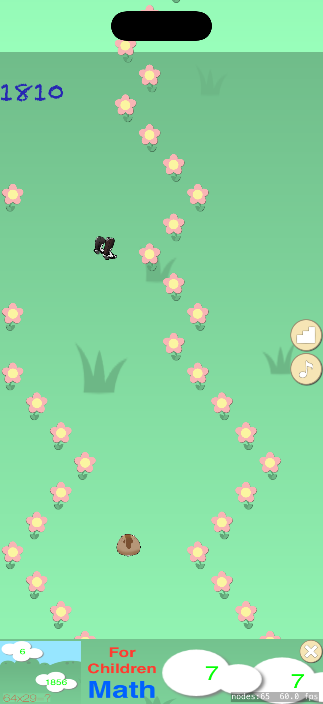
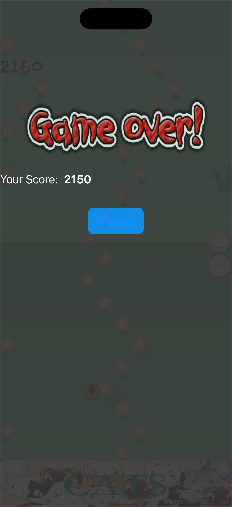

# HappySpeedUp (Swift port)

A Swift / SpriteKit re-implementation of the original Objective-C game
[`iOS_HappySpeedUp`](../iOS_HappySpeedUp). The hamster bounces between two
scrolling walls (tap to flip horizontal direction), grabs speed-up / speed-down
/ fly tools at score milestones, and the run ends on a wall collision. Game
Center leaderboards, a house-ad banner and background music are all ported.

  
  &nbsp;&nbsp;&nbsp;
  

## Requirements

- Xcode 15+
- iOS 14.0+ deployment target
